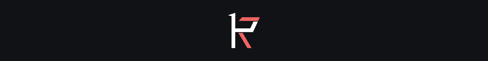

# Retail Chain

Retail Chain je 3D online videohra pro dva hráče. Jeden z hráčů se ujme obchodu a druhý továrny. Hráči musí vzájemně spolupracovat, neboť cílem hry je to, aby ani jeden z nich nezkrachoval. Hru lze hrát teoreticky do nekonečna, avšak obtížnost je čím dál těžší. Většinu hry si plní každý hráč své úkoly. Například hráč v obchodě musí uklízet a obsluhovat zákazníky. Na druhou stranu hráč v továrně musí vyrábět zboží. Důležitou součástí hry je také smlouva mezi hráči. Po uplynutí časového limitu od spuštění smlouvy se musí hráči opět domluvit na nových podmínkách, podle kterých se budou řídit, dokud bude tato smlouva platná.

## Jak spustit hru?
Nejnovější verze: https://github.com/David-Citron/Retail-Chain/releases/tag/Retail-Chain-alpha
Po stažení souborů hry postupuj podle těchto kroků:

1️⃣ Rozbal stažené soubory do libovolné složky. 
2️⃣ Otevři složku s hrou a najdi soubor RetailChain.exe. 
3️⃣ Ujisti se, že máš zapnutý Steam. 
4️⃣ Dvojklikem spusť RetailChain.exe a užij si hru! 

Pokud hra nejde spustit, zkontroluj, že máš nainstalovaný Steam a všechny soubory hry jsou správně rozbalené.

## Návod pro zapnutí hry

Pro spuštění hry je potřeba, aby jeden z hráčů založil lobby. To lze vytvořit pomocí tlačítka "create" na horní liště v hlavním menu.

Pokud se chcete k hráči připojit, je potřeba v horní liště zmáčknout tlačítko "join". To vás přesměruje na seznam lobbíček, ke kterým se můžete připojit. Pro připojení stačí jen zmáčknout červené tlačítko join u vašeho kamaráda.

Herní lobby z pohledu tvůrce by mělo vypadat takto:

Nyní se stačí dohodnout na tom, kdo použije jakou roli. Jakmile oba hráči budou připraveni, hra začne.

## Ukázka hry

Každý hráč má jiné úkoly. V továrně hráč musí vyrábět výrobky. V obchodě musí hráč vystavovat zboží a obsluhovat příchozí zákazníky.

## Konec hry

Pokud jeden z hráčů bude muset uhradit částku, na kterou nemá finanční kapitál, hra skončí pro oba hráče.

## Otevření projektu v Unity
Pro otevření projektu je vyžadována verze Unity 2022.3 (nebo novější) + Blender verze 4. Prvotní scénou je MainMenu. Před spuštěním do herního režimu musí být taktéž zapnutá aplikace Steam. Stačí aby běžela na pozadí. Všechny dependence jsou zahrnuty v repozitáři, takže knihovny není třeba instalovat.

## Technické informace
Pro tvorbu hry je použit herní engine Unity. Projekt je v 3D prostředí. Používá URP (Universal Render Pipeline). Hra vyžaduje Steam API, kterou používá pro mnoho nezbytných funkcí (např. NAT Punch-through). Vzhledem k tomu, že hra není oficiálně registrovaná na platformě Steam, využívá testovací ID hry (Spacewar - 480). 

Vytváření lobby, připojování a s tím spojené záležitosti jsou řešeny pomocí Steam API. Předávání samotných paketů pak řeší Mirror. Jeden z hráčů je vždy host (server + uživatel) -> není třeba hostovat dedikované servery.

Herní nastavení aktuálně ukládá jen data, které lokálně uchovává Unity. V budoucnu budou keybindy nahrávány na Steam Cloud. 

Mezi uživateli se synchronizují jen data nezbytně potřebná. Například pozice hráčů se nesynchronizuje. Tím šetříme šířku pásma, kterou hra potřebuje.

3D grafika je low-poly s prvky futurismu. Nevyužívá textury, pouze jednoduché materiály. Klade důraz na jednoduché tvary a intuitivní identitu. Například všechny "stroje" mají oranžovou barvu. Dále ji doplňuje bílá a šedá. Mapy pro oba hráče jsou oddělené, přesto sdílí podobnosti. Obě mají ku příkladu příjezdovou cestu pro dodávku nebo stejnou barvu stěn.

2D grafika navazuje na tyto myšlenky. Používá taktéž jednoduché tvary, ale částečně se odlišuje v barevném modelu. Například růžovo-červenou barvou tlačítek.

Hudba bude taktéž obsahovat prvky futurismu, aby podpořila herní identitu. Žádná skladba však ještě není zcela hotová a implementována do hry.

## Rozdělení práce
David Žižlavský:
- 3D modely
- Hudba a zvukové efekty
- Programování (smlouva, zákazníci, herní nastavení)

Michal Hlúch:
- 2D grafika
- Programování (kromě smlouvy)
- Animace

## Použité nástroje
- [Unity](https://unity.com) - Herní engine
- [Blender](https://www.blender.org) - 3D modely
- [FL Studio](https://www.image-line.com) - Hudební a zvuková produkce
- [Adobe Photoshop](https://www.adobe.com/products/photoshop) - Bitmapová grafika
- [Adobe Illustrator](https://www.adobe.com/products/illustrator) - Vektorová grafika

## Použité knihovny
### [Mirror](https://github.com/vis2k/Mirror)
OpenSource knihovna Mirror slouží jako základ pro správu síťové komunikace. Kód pro server i uživatele se píše do stejných scriptů.
### [Steamworks.NET](https://github.com/rlabrecque/Steamworks.NET)
Steam API wrapper pro C#. Vhodný pro Unity. Je velmi podobný originální C++ API přímo od Valve. [Oficiální dokumentace](https://partner.steamgames.com/doc/api) pro Steamworks je kompatibilní i s tímto wrapperem.
### [FizzySteamworks](https://github.com/Chykary/FizzySteamworks)
FizzySteamworks propojuje Mirror API a Steamworks.NET wrapper. Poskytuje totiž transport pro přenost dat, který používá knihovna Mirror. Tento transport je napojen na přímo na Steam API.
### TMP
TextMeshPro je knihovna Unity, která se již běžně používá. Umožňuje renderovat text ve vysokém rozlišení. Tím se liší od původního systému, který měl velmi omezující vlastnosti.
